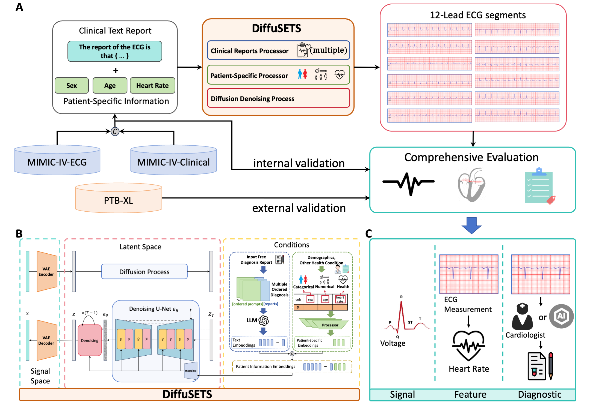

# DiffuSETS



Experiment code of paper [**_DiffuSETS: 12-lead ECG Generation Conditioned on Clinical Text Reports and Patient-Specific Information_**](http://arxiv.org/abs/2501.05932)

**Prerequisities** can be found at [Our Huggingface🤗 Hub](https://huggingface.co/Laiyf/DiffuSETS). Put them under the root of this repo as `./prerequisites/`.

## Inference 

Run inference accessing OpenAI api (more flexible):
```sh
python DiffuSETS_inference.py config/all.json
```

For configuration and input settings see this [section](#configurations).

Quick generation using pre-extracted conditions (no api requesting, but make sure you have downloaded prerequisites for inference):
```sh
python -m test_scripts.diversity
```

## Training

Training script is `DiffuSETS_train.py`, can be launched through 

```sh
python DiffuSETS_train.py config/all.json
```

For configuration settings see this [section](#configurations).

## Experiment

All scripts concerning with our experiments are included in `./test_scripts/`, please take a look freely.

## Configurations

The scripts of `DiffuSETS_train.py` and `DiffuSETS_inference.py` rely on configuration in json format to set up dependency paths and hyper parameters. 

Note that training and inference settings are written in ONE configuration file, so as to ensure the hyper parameters of UNET are the same.

Below is a example of settings with detailed explanation , you can alter it to meet with your environment and design. **Reminder**: `@key` is comment to `key`, so there is **NO** need to be included in the formal configuration file.

```json
{ 
    "meta": {
        "exp_name": "DiffuSETS", 

        "exp_type": "all", 
        "@exp_type": "the name of experiment saving folders, can use to indicating the model type", 
        
        "condition": true, 
        "@condition": "whether to use patient specific info",

        "vae_latent": true, 
        "@vae_latent": "generating latent or ECG", 

        "device": "cuda:1" 
    }, 

    "dependencies": { 
        "dataset_path": "./prerequisites/mimic_vae_lite.pt", 
        "@dataset_path": "path to mimic_vae.pt (dictdataset) or the folder contains vae latents", 

        "checkpoints_dir": "./checkpoints", 

        "vae_path": "./prerequisites/vae_model.pth", 
        "@vae_path": "ALWAYS need to be specified no matter whether generating latent or not", 
    },

    "hyper_para": {
        "epochs": 200, 
        "lr": 5e-4, 
        "batch_size": 512, 
        "num_train_steps": 1000, 
        "unet_kernel_size": 7, 
        "unet_num_level": 7, 
        "beta_start": 0.00085, 
        "beta_end": 0.0120
    }, 

    "@inference_setting": "ONLY concerning with inference scripts", 
    "inference_setting": {
        "inference_timestep": 1000, 

        "gen_batch": 4, 
        "@gen_batch": "number of ECGs generated each time", 

        "save_img": true, 
        "verbose": false,
        "save_path": "./test_sample_all", 
        "unet_path": "./text2ecg/prerequisites/unet_all.pth", 

        "text": "sinus rhythm|abnormal ecg.", 
        "@text": "text reports for generation, multiple reports are split by '|' ", 

        "OPENAI_API_KEY": "",  
        "@OPENAI_API_KEY": "Fill with your API KEY", 

        "age": 50, 
        "hr": 90, 
        "gender": "M"
    }
}
```
